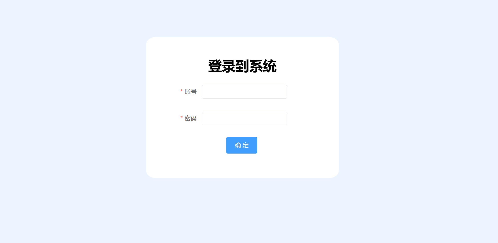
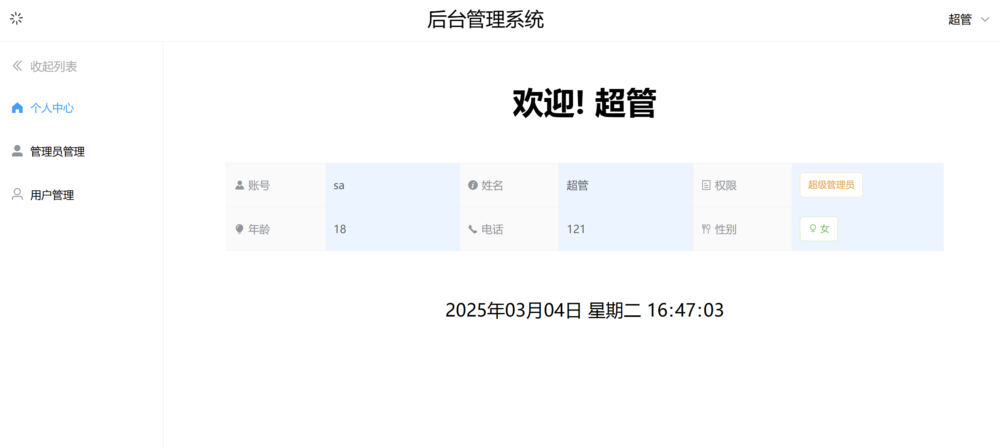
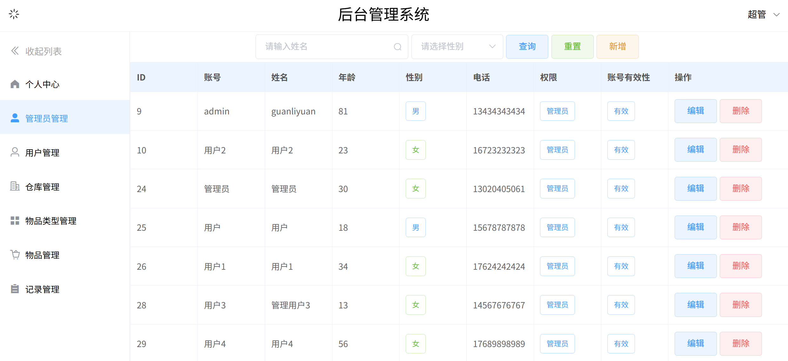
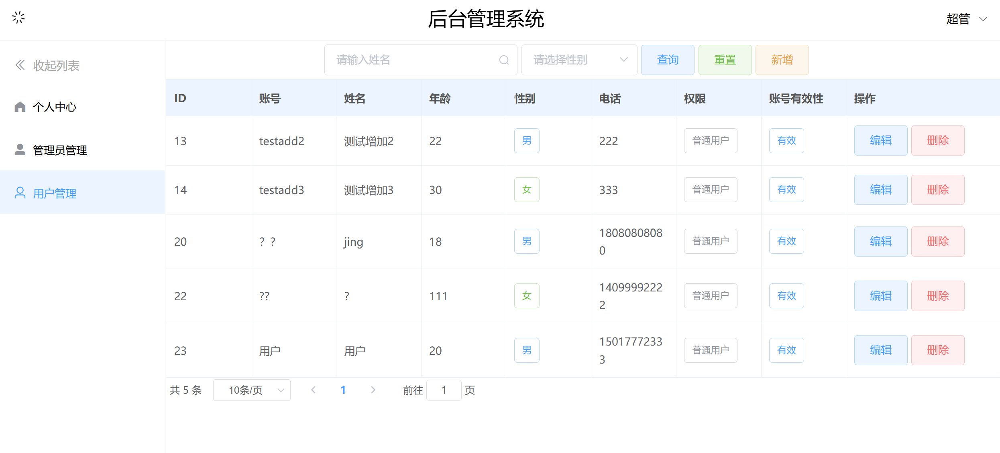
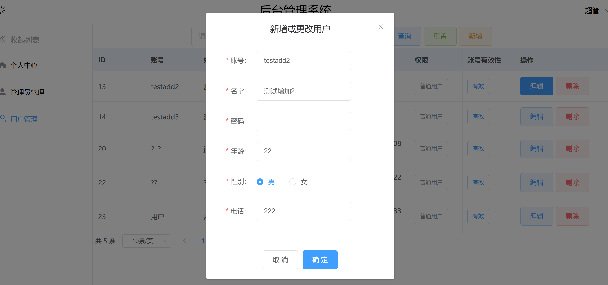
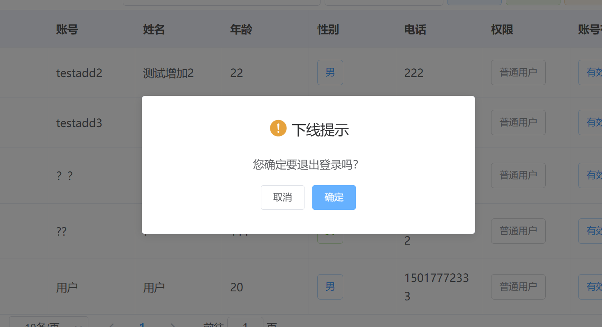

### 项目说明
基于网上资料学习后，创建的一个前后端分离的后台管理系统项目，前端使用Vue框架，后端使用SpringBoot框架，数据库使用MySQL。

### 项目预览

### 项目技术
前端：
- Vue
- ElementUI
- Axios
- Vue-Router
- Vuex

后端：
- SpringBoot
- MyBatis
- MyBatis-Plus
- Maven
- MySQL

### 已实现功能
- 用户登录
- 用户登出，有确认弹窗
- 根据用户信息，显示用户中心
- 用户中心显示当前时间
- 根据用户权限，动态显示侧边栏用户管理功能
- 侧边栏收起展开
- 超级管理员的管理员管理功能，超级管理员和管理员的普通用户管理功能
- 用户搜索查询、条件查询以及查询重置
- 已查询出的用户数据的分页管理
- 新建用户、编辑已有用户，有弹窗
- 删除已有用户，有确认提示

### 待实现功能
未来可能实现的功能：
- 用户注册界面
- 仓库管理

### 其他
项目的样式还需要进一步调整

为方便上传，前后端子项目的.git目录已经删除

后续项目更完善后应该会增加下载运行指南