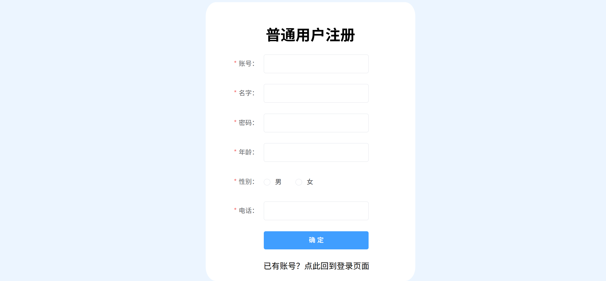
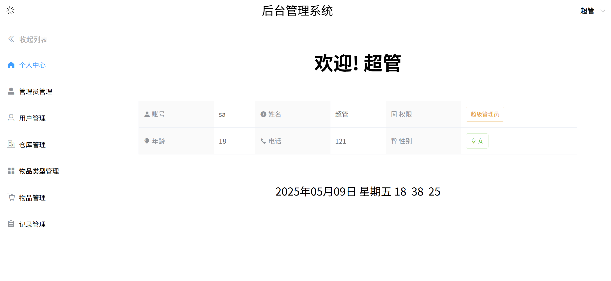
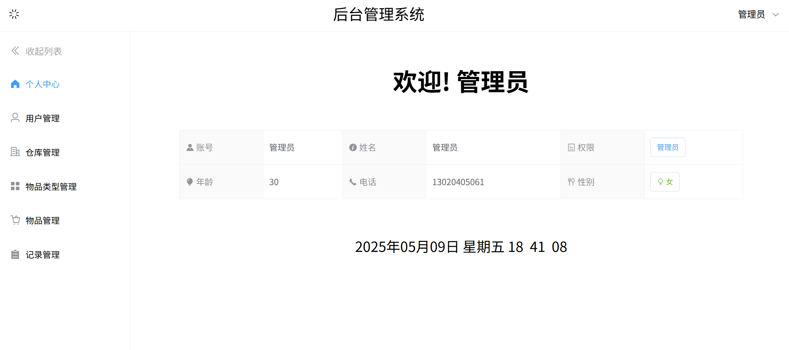
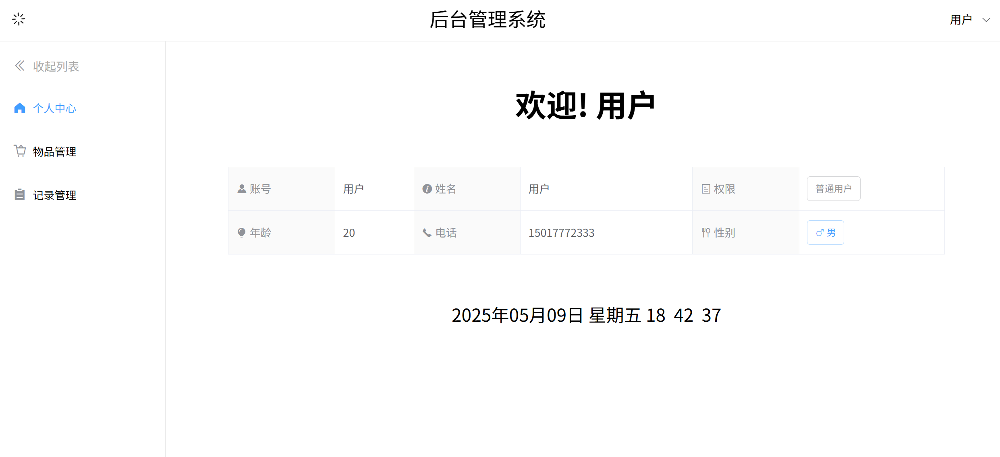
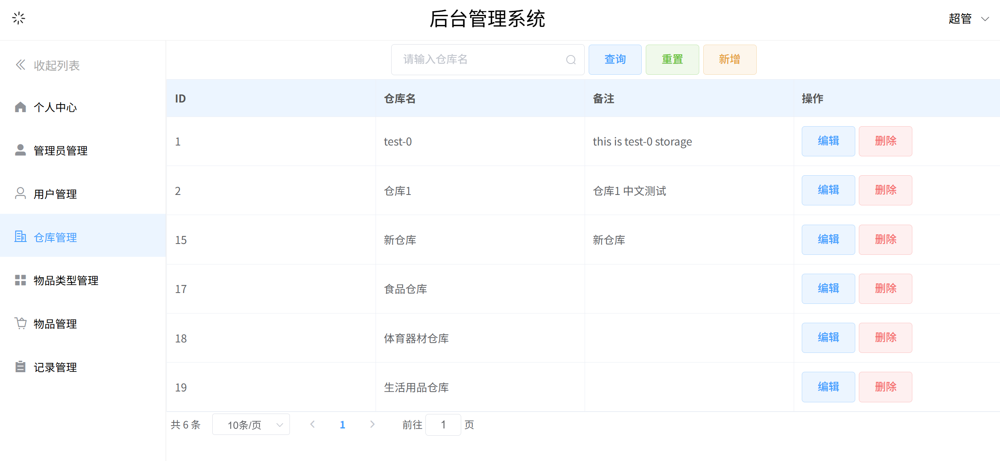
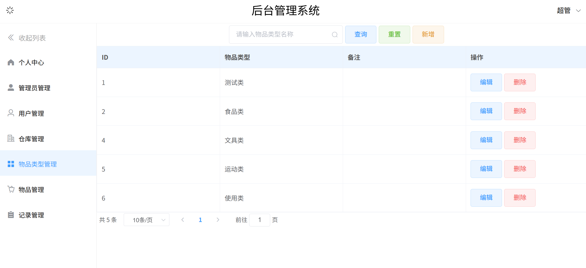
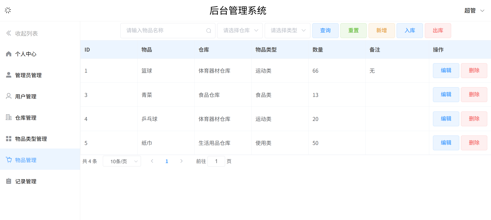
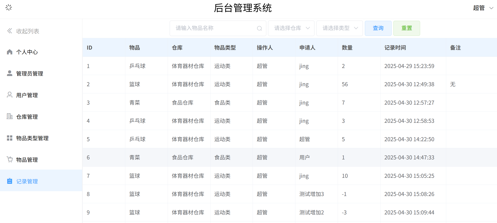

### 项目说明
基于学习，复现并改进的一个前后端分离的后台管理系统项目，前端使用Vue框架，后端使用SpringBoot框架，数据库使用MySQL

### 项目预览












### 项目技术
前端：
- Vue 2
- ElementUI
- Axios
- Vue-Router 3.5.4
- Vuex 3.0.0

后端：
- Java 8
- SpringBoot 2.7.6
- MyBatis & MyBatis-Plus
- Maven 3.8.8
- MySQL 8

### 已实现功能
- 用户登录
- 普通用户注册
- 登录注册跳转
- 用户登出，有确认弹窗

- 根据用户信息，显示用户中心
- 用户中心显示当前时间

- 根据用户权限，动态显示侧边栏用户管理功能
- 侧边栏收起展开

- 超级管理员的管理员管理功能，超级管理员和管理员的普通用户管理功能
- 超级管理员和管理员的仓库管理、物品类型管理功能
- 所有用户的物品管理、记录管理功能
- 优化权限控制，普通用户只能查看物品和自己的记录，管理员以上才能对物品和记录进行增删操作

- 管理内容的搜索查询、条件查询以及查询重置
- 已查询出的数据的分页管理
- 增加管理内容
- 删除管理内容，有确认提示

- 物品管理的出入库操作
- 物品管理关联记录管理的出入库记录操作

### 待实现功能
想实现的功能都大致完成了，后续可能将项目部署到服务器上，并配置公网访问途径

### 本地部署

本项目使用IDEA进行后端开发，WebStorm进行前端开发；后端使用Maven 3.8.8进行包管理，前端使用node版本为18.20.6

首先要连接自己的数据库，使用后端项目中sql文件夹中的脚本创建数据库和表

依赖则可以参考下面的步骤配置

配置后端子项目，先下载配置好Maven 3.8.8，之后同步pom.xml的设置即可

配置前端子项目需要使用npm手动引入依赖，在前端项目文件夹打开终端，使用以下命令安装依赖
``` bash
npm i element-ui -S
```
``` bash
npm i axios --save
```
``` bash
npm i vue-router@3.5.4
```
``` bash
npm i vuex@3.0.0
```

### 其他
正在整理开发流程、前后端接口等信息，后续也许会上传总结文档

为方便上传，前后端子项目的.git目录已经删除

由于完整文件大小过大，.gitignore没有删除，本地部署时需要自行安装库和依赖