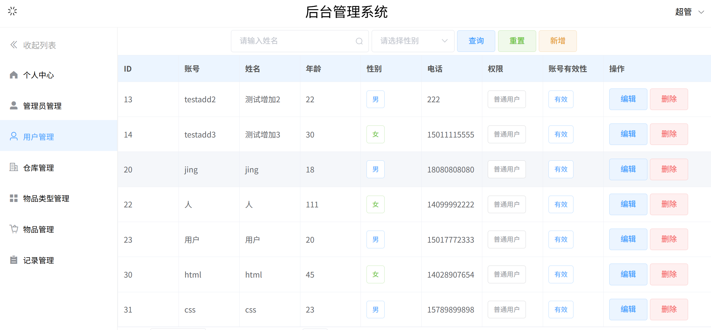

### 项目说明
基于网上资料学习后，创建的一个前后端分离的后台管理系统项目，前端使用Vue框架，后端使用SpringBoot框架，数据库使用MySQL

### 项目预览





### 项目技术
前端：
- Vue 2
- ElementUI
- Axios
- Vue-Router 3.5.4
- Vuex 3.0.0

后端：
- Java 8
- SpringBoot 2.7.6
- MyBatis & MyBatis-Plus
- Maven 3.8.8
- MySQL 8

### 已实现功能
- 用户登录
- 用户登出，有确认弹窗
- 根据用户信息，显示用户中心
- 用户中心显示当前时间
- 根据用户权限，动态显示侧边栏用户管理功能
- 侧边栏收起展开
- 超级管理员的管理员管理功能，超级管理员和管理员的普通用户管理功能
- 用户搜索查询、条件查询以及查询重置
- 已查询出的用户数据的分页管理
- 新建用户、编辑已有用户，有弹窗
- 删除已有用户，有确认提示

### 待实现功能
未来可能实现的功能：
- 普通用户注册界面
- 仓库管理或其他内容管理

### 下载运行

本项目使用IDEA进行后端开发，WebStorm进行前端开发；后端使用Maven 3.8.8进行包管理，前端使用node版本为18.20.6

首先要连接自己的数据库，使用后端项目中sql文件夹中的脚本创建数据库和表

依赖则可以参考下面的步骤配置

配置后端子项目，先下载配置好Maven 3.8.8，之后同步pom.xml的设置即可

配置前端子项目需要使用npm手动引入依赖，在前端项目文件夹打开终端，使用以下命令安装依赖
``` bash
npm i element-ui -S
```
``` bash
npm i axios --save
```
``` bash
npm i vue-router@3.5.4
```
``` bash
npm i vuex@3.0.0
```

### 其他
项目的样式还需要进一步调整

为方便上传，前后端子项目的.git目录已经删除